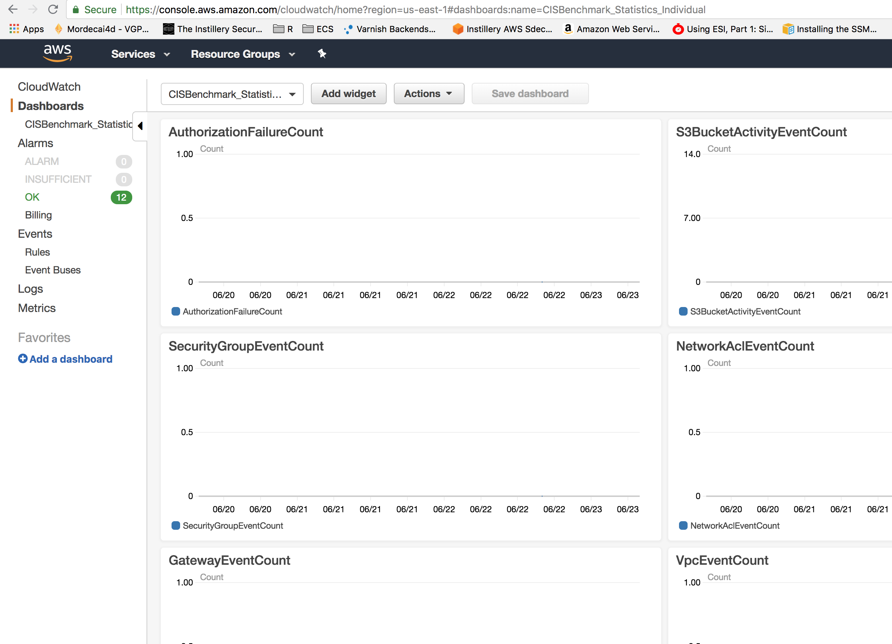

<!-- markdownlint-disable -->
# terraform-aws-cloudtrail-cloudwatch-alarms

 [](https://travis-ci.org/cloudposse/terraform-aws-cloudtrail-cloudwatch-alarms) [](https://github.com/cloudposse/terraform-aws-cloudtrail-cloudwatch-alarms/releases) [](https://slack.cloudposse.com)
<!-- markdownlint-restore -->

[![README Header][readme_header_img]][readme_header_link]

[![Cloud Posse][logo]](https://cpco.io/homepage)

<!--


  ** DO NOT EDIT THIS FILE
  **
  ** This file was automatically generated by the `build-harness`.
  ** 1) Make all changes to `README.yaml`
  ** 2) Run `make init` (you only need to do this once)
  ** 3) Run`make readme` to rebuild this file.
  **
  ** (We maintain HUNDREDS of open source projects. This is how we maintain our sanity.)
  **


-->

Terraform module for creating alarms for tracking important changes and occurances from cloudtrail.

This module creates a set of filter metrics and alarms based on the security best practices covered in the [AWS CIS Foundations Benchmark](https://d0.awsstatic.com/whitepapers/compliance/AWS_CIS_Foundations_Benchmark.pdf) guide.


---

This project is part of our comprehensive ["SweetOps"](https://cpco.io/sweetops) approach towards DevOps.
[][share_email]
[][share_googleplus]
[][share_facebook]
[][share_reddit]
[][share_linkedin]
[][share_twitter]


[][terraform_modules]


It's 100% Open Source and licensed under the [APACHE2](LICENSE).


We literally have [*hundreds of terraform modules*][terraform_modules] that are Open Source and well-maintained. Check them out!


## Security & Compliance [](https://bridgecrew.io/)

Security scanning is graciously provided by Bridgecrew. Bridgecrew is the leading fully hosted, cloud-native solution providing continuous Terraform security and compliance.

| Benchmark | Description |
|--------|---------------|
| [](https://www.bridgecrew.cloud/link/badge?vcs=github&fullRepo=cloudposse%2Fterraform-aws-cloudtrail-cloudwatch-alarms&benchmark=INFRASTRUCTURE+SECURITY) | Infrastructure Security Compliance |
| [](https://www.bridgecrew.cloud/link/badge?vcs=github&fullRepo=cloudposse%2Fterraform-aws-cloudtrail-cloudwatch-alarms&benchmark=CIS+KUBERNETES+V1.5) | Center for Internet Security, KUBERNETES Compliance |
| [](https://www.bridgecrew.cloud/link/badge?vcs=github&fullRepo=cloudposse%2Fterraform-aws-cloudtrail-cloudwatch-alarms&benchmark=CIS+AWS+V1.2) | Center for Internet Security, AWS Compliance |
| [](https://www.bridgecrew.cloud/link/badge?vcs=github&fullRepo=cloudposse%2Fterraform-aws-cloudtrail-cloudwatch-alarms&benchmark=CIS+AZURE+V1.1) | Center for Internet Security, AZURE Compliance |
| [](https://www.bridgecrew.cloud/link/badge?vcs=github&fullRepo=cloudposse%2Fterraform-aws-cloudtrail-cloudwatch-alarms&benchmark=PCI-DSS+V3.2) | Payment Card Industry Data Security Standards Compliance |
| [](https://www.bridgecrew.cloud/link/badge?vcs=github&fullRepo=cloudposse%2Fterraform-aws-cloudtrail-cloudwatch-alarms&benchmark=NIST-800-53) | National Institute of Standards and Technology Compliance |
| [](https://www.bridgecrew.cloud/link/badge?vcs=github&fullRepo=cloudposse%2Fterraform-aws-cloudtrail-cloudwatch-alarms&benchmark=ISO27001) | Information Security Management System, ISO/IEC 27001 Compliance |
| [](https://www.bridgecrew.cloud/link/badge?vcs=github&fullRepo=cloudposse%2Fterraform-aws-cloudtrail-cloudwatch-alarms&benchmark=SOC2)| Service Organization Control 2 Compliance |
| [](https://www.bridgecrew.cloud/link/badge?vcs=github&fullRepo=cloudposse%2Fterraform-aws-cloudtrail-cloudwatch-alarms&benchmark=CIS+GCP+V1.1) | Center for Internet Security, GCP Compliance |
| [](https://www.bridgecrew.cloud/link/badge?vcs=github&fullRepo=cloudposse%2Fterraform-aws-cloudtrail-cloudwatch-alarms&benchmark=HIPAA) | Health Insurance Portability and Accountability Compliance |


## Usage


**IMPORTANT:** We do not pin modules to versions in our examples because of the
difficulty of keeping the versions in the documentation in sync with the latest released versions.
We highly recommend that in your code you pin the version to the exact version you are
using so that your infrastructure remains stable, and update versions in a
systematic way so that they do not catch you by surprise.

Also, because of a bug in the Terraform registry ([hashicorp/terraform#21417](https://github.com/hashicorp/terraform/issues/21417)),
the registry shows many of our inputs as required when in fact they are optional.
The table below correctly indicates which inputs are required.


```hcl
module "metric_configs" {
  source  = "cloudposse/config/yaml"
  # Cloud Posse recommends pinning every module to a specific version
  # version     = "x.x.x"

  map_config_local_base_path = "./catalog"
  map_config_paths           = "*.yaml"

  context = module.this.context
}

module "cloudtrail_api_alarms" {
  source  = "cloudposse/cloudtrail-cloudwatch-alarms/aws"
  # Cloud Posse recommends pinning every module to a specific version
  # version     = "x.x.x"

  log_group_name = "${aws_cloudwatch_log_group.default.name}"
  metrics = module.metric_configs.map_configs
}
```
For detailed usage which includes setting up cloudtrail, cloudwatch logs, roles, policies, and the s3 bucket - as well as using this module see the [example directory](./examples/complete)


## Examples

Here's a complete [example](examples/complete/main.tf) of using this `terraform-aws-cloudtrail-cloudwatch-alarms` module.


<!-- markdownlint-disable -->
## Requirements

| Name | Version |
|------|---------|
| terraform | >= 0.13.0 |
| aws | >= 2.0 |

## Providers

| Name | Version |
|------|---------|
| aws | >= 2.0 |

## Modules

| Name | Source | Version |
|------|--------|---------|
| this | cloudposse/label/null | 0.24.1 |

## Resources

| Name |
|------|
| [aws_caller_identity](https://registry.terraform.io/providers/hashicorp/aws/latest/docs/data-sources/caller_identity) |
| [aws_cloudwatch_dashboard](https://registry.terraform.io/providers/hashicorp/aws/latest/docs/resources/cloudwatch_dashboard) |
| [aws_cloudwatch_log_metric_filter](https://registry.terraform.io/providers/hashicorp/aws/latest/docs/resources/cloudwatch_log_metric_filter) |
| [aws_cloudwatch_metric_alarm](https://registry.terraform.io/providers/hashicorp/aws/latest/docs/resources/cloudwatch_metric_alarm) |
| [aws_iam_policy_document](https://registry.terraform.io/providers/hashicorp/aws/latest/docs/data-sources/iam_policy_document) |
| [aws_region](https://registry.terraform.io/providers/hashicorp/aws/latest/docs/data-sources/region) |
| [aws_sns_topic](https://registry.terraform.io/providers/hashicorp/aws/latest/docs/resources/sns_topic) |
| [aws_sns_topic_policy](https://registry.terraform.io/providers/hashicorp/aws/latest/docs/resources/sns_topic_policy) |

## Inputs

| Name | Description | Type | Default | Required |
|------|-------------|------|---------|:--------:|
| additional\_endpoint\_arns | Any alert endpoints, such as autoscaling, or app scaling endpoint arns that will respond to an alert | `list(string)` | `[]` | no |
| additional\_tag\_map | Additional tags for appending to tags\_as\_list\_of\_maps. Not added to `tags`. | `map(string)` | `{}` | no |
| attributes | Additional attributes (e.g. `1`) | `list(string)` | `[]` | no |
| context | Single object for setting entire context at once.<br>See description of individual variables for details.<br>Leave string and numeric variables as `null` to use default value.<br>Individual variable settings (non-null) override settings in context object,<br>except for attributes, tags, and additional\_tag\_map, which are merged. | `any` | <pre>{<br>  "additional_tag_map": {},<br>  "attributes": [],<br>  "delimiter": null,<br>  "enabled": true,<br>  "environment": null,<br>  "id_length_limit": null,<br>  "label_key_case": null,<br>  "label_order": [],<br>  "label_value_case": null,<br>  "name": null,<br>  "namespace": null,<br>  "regex_replace_chars": null,<br>  "stage": null,<br>  "tags": {}<br>}</pre> | no |
| dashboard\_enabled | When true a dashboard that displays the statistics as a line graph will be created in CloudWatch | `bool` | `true` | no |
| delimiter | Delimiter to be used between `namespace`, `environment`, `stage`, `name` and `attributes`.<br>Defaults to `-` (hyphen). Set to `""` to use no delimiter at all. | `string` | `null` | no |
| enabled | Set to false to prevent the module from creating any resources | `bool` | `null` | no |
| environment | Environment, e.g. 'uw2', 'us-west-2', OR 'prod', 'staging', 'dev', 'UAT' | `string` | `null` | no |
| id\_length\_limit | Limit `id` to this many characters (minimum 6).<br>Set to `0` for unlimited length.<br>Set to `null` for default, which is `0`.<br>Does not affect `id_full`. | `number` | `null` | no |
| kms\_master\_key\_id | The ID of an AWS-managed customer master key (CMK) for Amazon SNS or a custom CMK | `string` | `"alias/aws/sns"` | no |
| label\_key\_case | The letter case of label keys (`tag` names) (i.e. `name`, `namespace`, `environment`, `stage`, `attributes`) to use in `tags`.<br>Possible values: `lower`, `title`, `upper`.<br>Default value: `title`. | `string` | `null` | no |
| label\_order | The naming order of the id output and Name tag.<br>Defaults to ["namespace", "environment", "stage", "name", "attributes"].<br>You can omit any of the 5 elements, but at least one must be present. | `list(string)` | `null` | no |
| label\_value\_case | The letter case of output label values (also used in `tags` and `id`).<br>Possible values: `lower`, `title`, `upper` and `none` (no transformation).<br>Default value: `lower`. | `string` | `null` | no |
| log\_group\_name | The cloudtrail cloudwatch log group name | `string` | n/a | yes |
| log\_group\_region | The log group region that should be monitored for unauthorised AWS API Access. Current region used if none provided. | `string` | `""` | no |
| metric\_namespace | A namespace for grouping all of the metrics together | `string` | `"CISBenchmark"` | no |
| metrics | The cloudwatch metrics and corresponding alarm definitions | <pre>map(object({<br>    name                      = string<br>    filter_pattern            = string<br>    metric_namespace          = string<br>    metric_value              = string<br>    alarm_comparison_operator = string<br>    alarm_evaluation_periods  = string<br>    alarm_period              = string<br>    alarm_statistic           = string<br>    alarm_treat_missing_data  = string<br>    alarm_threshold           = string<br>    alarm_description         = string<br>  }))</pre> | `{}` | no |
| name | Solution name, e.g. 'app' or 'jenkins' | `string` | `null` | no |
| namespace | Namespace, which could be your organization name or abbreviation, e.g. 'eg' or 'cp' | `string` | `null` | no |
| regex\_replace\_chars | Regex to replace chars with empty string in `namespace`, `environment`, `stage` and `name`.<br>If not set, `"/[^a-zA-Z0-9-]/"` is used to remove all characters other than hyphens, letters and digits. | `string` | `null` | no |
| sns\_policy\_enabled | Attach a policy that allows the notifications through to the SNS topic endpoint | `bool` | `false` | no |
| sns\_topic\_arn | An SNS topic ARN that has already been created. Its policy must already allow access from CloudWatch Alarms, or set `add_sns_policy` to `true` | `string` | `""` | no |
| stage | Stage, e.g. 'prod', 'staging', 'dev', OR 'source', 'build', 'test', 'deploy', 'release' | `string` | `null` | no |
| tags | Additional tags (e.g. `map('BusinessUnit','XYZ')` | `map(string)` | `{}` | no |

## Outputs

| Name | Description |
|------|-------------|
| dashboard\_combined | URL to CloudWatch Combined Metric Dashboard |
| dashboard\_individual | URL to CloudWatch Individual Metric Dashboard |
| sns\_topic\_arn | The ARN of the SNS topic used |
<!-- markdownlint-restore -->
## Metrics Tracked

|  Alarm's Name |  Description       |
|:--------------|:-------------------|
|  `AuthorizationFailureCount`       |  Alarms when an unauthorized API call is made.  |
|  `S3BucketActivityEventCount`      |  Alarms when an API call is made to S3 to put or delete a Bucket, Bucket Policy or Bucket ACL.  |
|  `SecurityGroupEventCount`         |  Alarms when an API call is made to create, update or delete a Security Group.  |
|  `NetworkAclEventCount`            |  Alarms when an API call is made to create, update or delete a Network ACL.  |
|  `GatewayEventCount`               |  Alarms when an API call is made to create, update or delete a Customer or Internet Gateway.  |
|  `VpcEventCount`                   |  Alarms when an API call is made to create, update or delete a VPC, VPC peering connection or VPC connection to classic.  |
|  `EC2InstanceEventCount`           |  Alarms when an API call is made to create, terminate, start, stop or reboot an EC2 instance.  |
|  `EC2LargeInstanceEventCount`      |  Alarms when an API call is made to create, terminate, start, stop or reboot a 4x-large or greater EC2 instance.  |
|  `CloudTrailEventCount`            |  Alarms when an API call is made to create, update or delete a .cloudtrail. trail, or to start or stop logging to a trail.  |
|  `ConsoleSignInFailureCount`       |  Alarms when an unauthenticated API call is made to sign into the console.  |
|  `IAMPolicyEventCount`             |  Alarms when an API call is made to change an IAM policy.   |
|  `ConsoleSignInWithoutMfaCount`    |  Alarms when a user logs into the console without MFA.   |
|  `RootAccountUsageCount`           |  Alarms when a root account usage is detected.   |
|  `KMSKeyPendingDeletionErrorCount` |  Alarms when a customer created KMS key is pending deletion.    |
|  `AWSConfigChangeCount`            |  Alarms when AWS Config changes.   |
|  `RouteTableChangesCount`          |  Alarms when route table changes are detected.   |

## Dashboard Created

Two CloudWatch Dashboards can be created as well, and will be automatically created by default.



## Credits

The alarm metric names, descriptions, and filters [from this repository were used](https://github.com/TeliaSoneraNorge/telia-terraform-modules/tree/master/cloudtrail-forwarder).

With many thanks to [Anton Babenko](https://github.com/antonbabenko) for pointing it out and saving us a lot of time scouring reference documents and describing alarms!


## Share the Love

Like this project? Please give it a ★ on [our GitHub](https://github.com/cloudposse/terraform-aws-cloudtrail-cloudwatch-alarms)! (it helps us **a lot**)

Are you using this project or any of our other projects? Consider [leaving a testimonial][testimonial]. =)


## Related Projects

Check out these related projects.

- [terraform-aws-cloudtrail](https://github.com/cloudposse/terraform-aws-cloudtrail) - Terraform module to provision an AWS CloudTrail and an encrypted S3 bucket with versioning to store CloudTrail logs
- [terraform-aws-cloudtrail-s3-bucket](https://github.com/cloudposse/terraform-aws-cloudtrail-s3-bucket) - S3 bucket with built in IAM policy to allow CloudTrail logs
- [terraform-aws-cloudwatch-logs](https://github.com/cloudposse/terraform-aws-cloudwatch-logs) - Terraform Module to Provide a CloudWatch Logs Endpoint
- [terraform-aws-cloudwatch-flow-logs](https://github.com/cloudposse/terraform-aws-cloudwatch-flow-logs) - Terraform module for enabling flow logs for vpc and subnets.
- [terraform-aws-ec2-cloudwatch-sns-alarms](https://github.com/cloudposse/terraform-aws-ec2-cloudwatch-sns-alarms) - Terraform module that configures CloudWatch SNS alerts for EC2 instances
- [terraform-aws-ecs-cloudwatch-sns-alarms](https://github.com/cloudposse/terraform-aws-ecs-cloudwatch-sns-alarms) - Terraform module for creating ECS service level alerts that go to an SNS endpoint
- [terraform-aws-efs-cloudwatch-sns-alarms](https://github.com/cloudposse/terraform-aws-efs-cloudwatch-sns-alarms) - Terraform module that configures CloudWatch SNS alerts for EFS
- [terrform-aws-elasticache-cloudwatch-sns-alarms](https://github.com/cloudposse/terraform-aws-elasticache-cloudwatch-sns-alarms) - Terraform module that configures CloudWatch SNS alerts for ElastiCache
- [terraform-aws-lambda-cloudwatch-sns-alarms](https://github.com/cloudposse/terraform-aws-lambda-cloudwatch-sns-alarms) - Terraform module for creating a set of Lambda alarms and outputting to an endpoint
- [terraform-aws-rds-cloudwatch-sns-alarms](https://github.com/cloudposse/terraform-aws-rds-cloudwatch-sns-alarms) - Terraform module that configures important RDS alerts using CloudWatch and sends them to an SNS topic
- [terraform-aws-sqs-cloudwatch-sns-alarms](https://github.com/cloudposse/terraform-aws-sqs-cloudwatch-sns-alarms) - Terraform module for creating alarms for SQS and notifying endpoints


## Help

**Got a question?** We got answers.

File a GitHub [issue](https://github.com/cloudposse/terraform-aws-cloudtrail-cloudwatch-alarms/issues), send us an [email][email] or join our [Slack Community][slack].

[![README Commercial Support][readme_commercial_support_img]][readme_commercial_support_link]

## DevOps Accelerator for Startups


We are a [**DevOps Accelerator**][commercial_support]. We'll help you build your cloud infrastructure from the ground up so you can own it. Then we'll show you how to operate it and stick around for as long as you need us.

[][commercial_support]

Work directly with our team of DevOps experts via email, slack, and video conferencing.

We deliver 10x the value for a fraction of the cost of a full-time engineer. Our track record is not even funny. If you want things done right and you need it done FAST, then we're your best bet.

- **Reference Architecture.** You'll get everything you need from the ground up built using 100% infrastructure as code.
- **Release Engineering.** You'll have end-to-end CI/CD with unlimited staging environments.
- **Site Reliability Engineering.** You'll have total visibility into your apps and microservices.
- **Security Baseline.** You'll have built-in governance with accountability and audit logs for all changes.
- **GitOps.** You'll be able to operate your infrastructure via Pull Requests.
- **Training.** You'll receive hands-on training so your team can operate what we build.
- **Questions.** You'll have a direct line of communication between our teams via a Shared Slack channel.
- **Troubleshooting.** You'll get help to triage when things aren't working.
- **Code Reviews.** You'll receive constructive feedback on Pull Requests.
- **Bug Fixes.** We'll rapidly work with you to fix any bugs in our projects.

## Slack Community

Join our [Open Source Community][slack] on Slack. It's **FREE** for everyone! Our "SweetOps" community is where you get to talk with others who share a similar vision for how to rollout and manage infrastructure. This is the best place to talk shop, ask questions, solicit feedback, and work together as a community to build totally *sweet* infrastructure.

## Discourse Forums

Participate in our [Discourse Forums][discourse]. Here you'll find answers to commonly asked questions. Most questions will be related to the enormous number of projects we support on our GitHub. Come here to collaborate on answers, find solutions, and get ideas about the products and services we value. It only takes a minute to get started! Just sign in with SSO using your GitHub account.

## Newsletter

Sign up for [our newsletter][newsletter] that covers everything on our technology radar.  Receive updates on what we're up to on GitHub as well as awesome new projects we discover.

## Office Hours

[Join us every Wednesday via Zoom][office_hours] for our weekly "Lunch & Learn" sessions. It's **FREE** for everyone!

[][office_hours]

## Contributing

### Bug Reports & Feature Requests

Please use the [issue tracker](https://github.com/cloudposse/terraform-aws-cloudtrail-cloudwatch-alarms/issues) to report any bugs or file feature requests.

### Developing

If you are interested in being a contributor and want to get involved in developing this project or [help out](https://cpco.io/help-out) with our other projects, we would love to hear from you! Shoot us an [email][email].

In general, PRs are welcome. We follow the typical "fork-and-pull" Git workflow.

 1. **Fork** the repo on GitHub
 2. **Clone** the project to your own machine
 3. **Commit** changes to your own branch
 4. **Push** your work back up to your fork
 5. Submit a **Pull Request** so that we can review your changes

**NOTE:** Be sure to merge the latest changes from "upstream" before making a pull request!


## Copyright

Copyright © 2017-2021 [Cloud Posse, LLC](https://cpco.io/copyright)


## License

[](https://opensource.org/licenses/Apache-2.0)

See [LICENSE](LICENSE) for full details.

```text
Licensed to the Apache Software Foundation (ASF) under one
or more contributor license agreements.  See the NOTICE file
distributed with this work for additional information
regarding copyright ownership.  The ASF licenses this file
to you under the Apache License, Version 2.0 (the
"License"); you may not use this file except in compliance
with the License.  You may obtain a copy of the License at

  https://www.apache.org/licenses/LICENSE-2.0

Unless required by applicable law or agreed to in writing,
software distributed under the License is distributed on an
"AS IS" BASIS, WITHOUT WARRANTIES OR CONDITIONS OF ANY
KIND, either express or implied.  See the License for the
specific language governing permissions and limitations
under the License.
```


## Trademarks

All other trademarks referenced herein are the property of their respective owners.

## About

This project is maintained and funded by [Cloud Posse, LLC][website]. Like it? Please let us know by [leaving a testimonial][testimonial]!

[![Cloud Posse][logo]][website]

We're a [DevOps Professional Services][hire] company based in Los Angeles, CA. We ❤️  [Open Source Software][we_love_open_source].

We offer [paid support][commercial_support] on all of our projects.

Check out [our other projects][github], [follow us on twitter][twitter], [apply for a job][jobs], or [hire us][hire] to help with your cloud strategy and implementation.


### Contributors

<!-- markdownlint-disable -->
|  [![Erik Osterman][osterman_avatar]][osterman_homepage]<br/>[Erik Osterman][osterman_homepage] | [![Jamie Nelson][Jamie-BitFlight_avatar]][Jamie-BitFlight_homepage]<br/>[Jamie Nelson][Jamie-BitFlight_homepage] | [![Anton Babenko][antonbabenko_avatar]][antonbabenko_homepage]<br/>[Anton Babenko][antonbabenko_homepage] | [![PePe Amengual][jamengual_avatar]][jamengual_homepage]<br/>[PePe Amengual][jamengual_homepage] |
|---|---|---|---|
<!-- markdownlint-restore -->


  [osterman_homepage]: https://github.com/osterman
  [osterman_avatar]: http://s.gravatar.com/avatar/88c480d4f73b813904e00a5695a454cb?s=144


  [Jamie-BitFlight_homepage]: https://github.com/Jamie-BitFlight
  [Jamie-BitFlight_avatar]: https://avatars0.githubusercontent.com/u/25075504?s=144&u=ac7e53bda3706cb9d51907808574b6d342703b3e&v=4


  [antonbabenko_homepage]: https://github.com/antonbabenko
  [antonbabenko_avatar]: https://avatars3.githubusercontent.com/u/393243?s=144&v=4

  [jamengual_homepage]: https://github.com/jamengual
  [jamengual_avatar]: https://avatars.githubusercontent.com/u/2208324?s=460&u=4aad5a88c8d514db5a295026e762654d814747c0&v=4


[![README Footer][readme_footer_img]][readme_footer_link]
[![Beacon][beacon]][website]

  [logo]: https://cloudposse.com/logo-300x69.svg
  [docs]: https://cpco.io/docs?utm_source=github&utm_medium=readme&utm_campaign=cloudposse/terraform-aws-cloudtrail-cloudwatch-alarms&utm_content=docs
  [website]: https://cpco.io/homepage?utm_source=github&utm_medium=readme&utm_campaign=cloudposse/terraform-aws-cloudtrail-cloudwatch-alarms&utm_content=website
  [github]: https://cpco.io/github?utm_source=github&utm_medium=readme&utm_campaign=cloudposse/terraform-aws-cloudtrail-cloudwatch-alarms&utm_content=github
  [jobs]: https://cpco.io/jobs?utm_source=github&utm_medium=readme&utm_campaign=cloudposse/terraform-aws-cloudtrail-cloudwatch-alarms&utm_content=jobs
  [hire]: https://cpco.io/hire?utm_source=github&utm_medium=readme&utm_campaign=cloudposse/terraform-aws-cloudtrail-cloudwatch-alarms&utm_content=hire
  [slack]: https://cpco.io/slack?utm_source=github&utm_medium=readme&utm_campaign=cloudposse/terraform-aws-cloudtrail-cloudwatch-alarms&utm_content=slack
  [linkedin]: https://cpco.io/linkedin?utm_source=github&utm_medium=readme&utm_campaign=cloudposse/terraform-aws-cloudtrail-cloudwatch-alarms&utm_content=linkedin
  [twitter]: https://cpco.io/twitter?utm_source=github&utm_medium=readme&utm_campaign=cloudposse/terraform-aws-cloudtrail-cloudwatch-alarms&utm_content=twitter
  [testimonial]: https://cpco.io/leave-testimonial?utm_source=github&utm_medium=readme&utm_campaign=cloudposse/terraform-aws-cloudtrail-cloudwatch-alarms&utm_content=testimonial
  [office_hours]: https://cloudposse.com/office-hours?utm_source=github&utm_medium=readme&utm_campaign=cloudposse/terraform-aws-cloudtrail-cloudwatch-alarms&utm_content=office_hours
  [newsletter]: https://cpco.io/newsletter?utm_source=github&utm_medium=readme&utm_campaign=cloudposse/terraform-aws-cloudtrail-cloudwatch-alarms&utm_content=newsletter
  [discourse]: https://ask.sweetops.com/?utm_source=github&utm_medium=readme&utm_campaign=cloudposse/terraform-aws-cloudtrail-cloudwatch-alarms&utm_content=discourse
  [email]: https://cpco.io/email?utm_source=github&utm_medium=readme&utm_campaign=cloudposse/terraform-aws-cloudtrail-cloudwatch-alarms&utm_content=email
  [commercial_support]: https://cpco.io/commercial-support?utm_source=github&utm_medium=readme&utm_campaign=cloudposse/terraform-aws-cloudtrail-cloudwatch-alarms&utm_content=commercial_support
  [we_love_open_source]: https://cpco.io/we-love-open-source?utm_source=github&utm_medium=readme&utm_campaign=cloudposse/terraform-aws-cloudtrail-cloudwatch-alarms&utm_content=we_love_open_source
  [terraform_modules]: https://cpco.io/terraform-modules?utm_source=github&utm_medium=readme&utm_campaign=cloudposse/terraform-aws-cloudtrail-cloudwatch-alarms&utm_content=terraform_modules
  [readme_header_img]: https://cloudposse.com/readme/header/img
  [readme_header_link]: https://cloudposse.com/readme/header/link?utm_source=github&utm_medium=readme&utm_campaign=cloudposse/terraform-aws-cloudtrail-cloudwatch-alarms&utm_content=readme_header_link
  [readme_footer_img]: https://cloudposse.com/readme/footer/img
  [readme_footer_link]: https://cloudposse.com/readme/footer/link?utm_source=github&utm_medium=readme&utm_campaign=cloudposse/terraform-aws-cloudtrail-cloudwatch-alarms&utm_content=readme_footer_link
  [readme_commercial_support_img]: https://cloudposse.com/readme/commercial-support/img
  [readme_commercial_support_link]: https://cloudposse.com/readme/commercial-support/link?utm_source=github&utm_medium=readme&utm_campaign=cloudposse/terraform-aws-cloudtrail-cloudwatch-alarms&utm_content=readme_commercial_support_link
  [share_twitter]: https://twitter.com/intent/tweet/?text=terraform-aws-cloudtrail-cloudwatch-alarms&url=https://github.com/cloudposse/terraform-aws-cloudtrail-cloudwatch-alarms
  [share_linkedin]: https://www.linkedin.com/shareArticle?mini=true&title=terraform-aws-cloudtrail-cloudwatch-alarms&url=https://github.com/cloudposse/terraform-aws-cloudtrail-cloudwatch-alarms
  [share_reddit]: https://reddit.com/submit/?url=https://github.com/cloudposse/terraform-aws-cloudtrail-cloudwatch-alarms
  [share_facebook]: https://facebook.com/sharer/sharer.php?u=https://github.com/cloudposse/terraform-aws-cloudtrail-cloudwatch-alarms
  [share_googleplus]: https://plus.google.com/share?url=https://github.com/cloudposse/terraform-aws-cloudtrail-cloudwatch-alarms
  [share_email]: mailto:?subject=terraform-aws-cloudtrail-cloudwatch-alarms&body=https://github.com/cloudposse/terraform-aws-cloudtrail-cloudwatch-alarms
  [beacon]: https://ga-beacon.cloudposse.com/UA-76589703-4/cloudposse/terraform-aws-cloudtrail-cloudwatch-alarms?pixel&cs=github&cm=readme&an=terraform-aws-cloudtrail-cloudwatch-alarms
